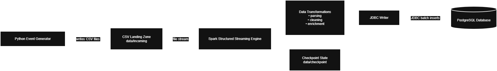

# Project Overview: Real-Time Data Ingestion Pipeline
Real-Time Data Ingestion Using Spark Structured Streaming & PostgreSQL
## Objective
This goal is to design and implement a real-time data ingestion pipeline that simulates user
activity on an e-commerce platform. Synthetic user events such as product views
and purchases are generated continuously, processed using Apache Spark
Structured Streaming, and stored in a PostgreSQL database for analysis.

---

## System Architecture
The pipeline consists of four main stages:

1. **Event Generation**  
   A Python script generates synthetic e-commerce events and writes them as CSV
   files at regular intervals, simulating a real-time data source.

2. **Landing Zone (File-Based Stream Source)**  
   Generated CSV files are written to a designated input directory, which
   serves as the streaming source monitored by Spark Structured Streaming.

3. **Stream Processing and Transformation**  
   Spark Structured Streaming application monitors the input directory,
   processes new files in micro-batches, applies data cleaning and validation
   logic, and manages streaming state using checkpointing.

   Checkpointing is enabled to maintain streaming state and ensure fault
   tolerance.

4. **Persistent Storage**  
   Cleaned and validated records are written to a PostgreSQL database using
   JDBC in append mode. This enables reliable storage and downstream querying
   of near-real-time data.

The overall data flow is illustrated in the system architecture diagram below.

---
## Design Considerations
- **Streaming over Batch**: Structured Streaming allows the pipeline to handle
  continuously arriving data with predictable micro-batch execution.
- **Fault Tolerance**: Checkpointing ensures that streaming state can be
  recovered in case of failures.
- **Simplicity**: File-based ingestion for transparency and ease
  of inspection during learning and testing.

## Tools
- **Python** – synthetic data generation  
- **Apache Spark Structured Streaming** – real-time data processing  
- **PostgreSQL** – relational storage for processed events  
